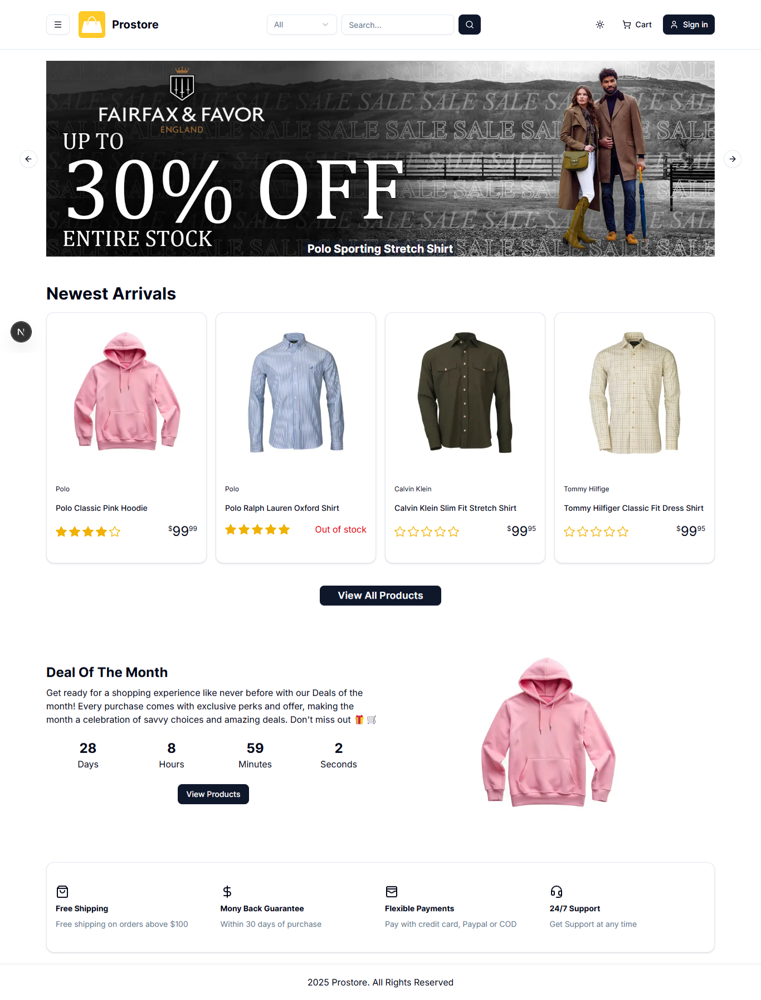

# 🛒 Prostore - Complete E-Commerce Solution

[](https://nextjs.org/)
[](https://react.dev/)
[](https://www.typescriptlang.org/)
[](https://tailwindcss.com/)
[](https://reactbd.com/)

A modern, feature-rich e-commerce application built with Next.js 15, TypeScript, Next-Auth Authentication, and Stripe/Paypal Payments.



## ✨ Features

### 🎯 Core Features

- 🛍️ **Product Management** - Complete product catalog with categories, brands, and search
- 🛒 **Shopping Cart** - Persistent cart with real-time updates
- 👤 **User Authentication** - Secure authentication via Clerk
- 📦 **Order Management** - Track orders and order history
- 💳 **Multiple Payment Methods** - Stripe, Paypal, and Cash on Delivery
- 📱 **Responsive Design** - Mobile-first responsive UI
- 🎨 **Modern UI/UX** - Built with Tailwind CSS
- 🔍 **Advanced Search & Filters** - Filter by category, brand, price, and more
- ⭐ **Product Reviews** - Customer reviews and ratings
- 📧 **Email Notifications** - Order confirmations and updates via Resend
- 📊 **Advanced Analytics Dashboard** - Comprehensive business insights
- 🎨 **Custom Admin Branding** - Customize admin panel
- 📈 **Customer Insights & Reports** - Detailed customer analytics

---

## 🚀 Quick Start Guide

### Prerequisites

Before you begin, ensure you have the following installed:

- **Node.js** 18.0 or higher ([Download](https://nodejs.org/))
- **npm**, **yarn**, or **pnpm** package manager
- **Git** ([Download](https://git-scm.com/))

---

## 📋 Step-by-Step Setup

### 1️⃣ Clone the Repository

```bash
git clone https://github.com/Zouhair-Al-Yazji/Prostore
cd Prostore
```

### 2️⃣ Install Dependencies

Choose your preferred package manager:

```bash
# Using npm
npm install

# Using yarn
yarn install

# Using pnpm (recommended)
pnpm install
```

### 3️⃣ Set Up Environment Variables

Create a `.env` file in the root directory and add the following variables:

```bash
# Server URL and General information
NEXT_PUBLIC_SERVER_URL=http://localhost:3000
NEXT_PUBLIC_APP_NAME=your_app_name
NEXT_PUBLIC_APP_DESCRIPTION=your_app_description

# Prisma Configuration
DATABASE_URL=your_database_url
VERCEL_OIDC_TOKEN=your_vercel_oidc_token

# Next-Auth Authentication
NEXT_PUBLIC_CLERK_PUBLISHABLE_KEY=your_clerk_publishable_key
CLERK_SECRET_KEY=your_clerk_secret_key

NEXTAUTH_SECRET=your_next_auth_secret
NEXTAUTH_URL=your_next_auth_url
NEXTAUTH_URL_INTERNEL=your_next_auth_internel_url

# Stripe Payment Gateway
NEXT_PUBLIC_STRIPE_PUBLISHABLE_KEY=your_stripe_publishable_key
STRIPE_SECRET_KEY=your_stripe_secret_key
STRIPE_WEBHOOK_SECRET=your_stripe_webhook_secret

PAYMENT_METHODS=PayPal,Stripe,CashOnDelivery
DEFAULT_PAYMENT_METHOD=PayPal
PAGE_SIZE=12
USER_ROLES=admin,user

# Paypal Payment Gateway
PAYPAL_API_URL=your_paypal_api_url
PAYPAL_CLIENT_ID=your_paypal_client_id
PAYPAL_APP_SECRET=your_paypal_app_secret

# Uploadthing
UPLOADTHING_TOKEN=your_uploadthing_token
UPLOADTHING_SECRET=your_uploadthing_secret
UPLOADTHING_APPID=your_app_id

# Email Configuration (RESEND)
RESEND_API_KEY=your_resend_api_key
SENDER_EMAIL=your_email@gmail.com
```

---

## 🏃‍♂️ Running the Application

### Development Mode

Start the development server with Turbopack (faster):

```bash
# Using npm
npm run dev

# Using yarn
yarn dev

# Using pnpm
pnpm dev
```

### Production Build

```bash
# Build the application
npm run build

# Start the production server
npm start
```

---

## 🎯 Key Technologies

| Technology       | Version | Purpose         | Documentation                                                 |
| ---------------- | ------- | --------------- | ------------------------------------------------------------- |
| **Next.js**      | 15.5.4  | React framework | [Docs](https://nextjs.org/docs)                               |
| **React**        | 19.1.0  | UI library      | [Docs](https://react.dev/)                                    |
| **TypeScript**   | 5.7.3   | Type safety     | [Docs](https://www.typescriptlang.org/docs/)                  |
| **Tailwind CSS** | 4.1.16  | Styling         | [Docs](https://tailwindcss.com/docs)                          |
| **Prisma**       | 6.16.3  | CMS             | [Docs](https://www.prisma.io/docs)                            |
| **Next Auth**    | 6.34.1  | Authentication  | [Docs](https://next-auth.js.org/getting-started/introduction) |
| **Stripe**       | 19.2.0  | Payments        | [Docs](https://stripe.com/docs)                               |
| **Firebase**     | 12.5.0  | Notifications   | [Docs](https://firebase.google.com/docs)                      |
| **Resend**       | 6.4.2   | Email service   | [Docs](https://resend.com/docs/introduction)                  |

---

## 🚀 Deployment

### Deploy to Vercel (Recommended)

1. Push your code to GitHub
2. Visit [Vercel](https://vercel.com/)
3. Import your repository
4. Add all environment variables from `.env`
5. Update `NEXT_PUBLIC_BASE_URL` to your domain
6. Deploy!

---

<div align="center">

**Made with ❤️ by [Zouhair Elyazji](https://github.com/Zouhair-Al-Yazji)**

⭐ Star this repo if you find it helpful!

</div>
